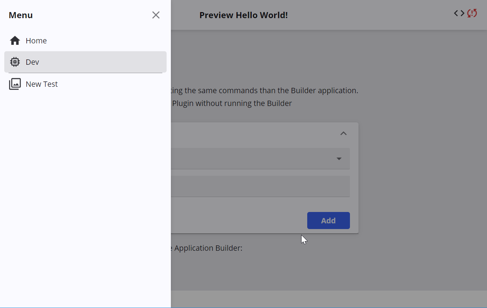

A framework for building applications
without coding at all.
[Play with a demo!](https://dont-code.github.io/ide-ui/)

# What is it ?
Create the exact application you need without technical knowledge. The simplest way to get what you need.

# how is it working ?
**It provides an Application builder**

with pre-defined questions.

Filling up the values let you express what you want to do with the application.

**It provides as well a Preview Application**

that shows you in realtime the result of your changes.

# What is this status
Dont-Code is still in infancy, but you can already play a bit with it.
Go to the [Application Builder url](https://dont-code.github.io/ide-ui/), and follow the instructions !

Right now, you can see the working behavior of the dont-code app by
- Changing the app title
- Seeing the menus reflecting the items you want to use in your application

Opensource, dont-code is a framework extensible through plugins.
Developers from anywhere can provide plugins and extend the functionalities offered.
Follow the developer's page to see how you can 